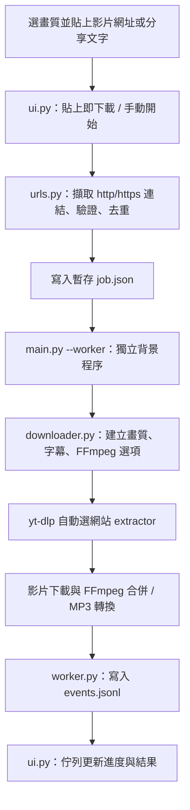

# NEON Video 專案架構

在 VS Code 選「檔案 → 開啟資料夾」，開啟本檔案所在的 `NEON-Source`。
先讀本檔案，再開 [main.py](main.py)；左側 Explorer 即可看到全部模組。

```text
NEON-Source/
├── ARCHITECTURE.md          ← 本架構導覽
├── README.md                ← 安裝、操作與開發
├── main.py                  ← GUI / worker 共用入口
├── NEON.code-workspace       ← 雙擊開啟 VS Code 專案
├── neon/
│   ├── __init__.py          ← 版本
│   ├── ui.py                ← 深色介面、貼上事件、進度、停止
│   ├── urls.py              ← 分享文字擷取、網址去重、平台名稱
│   ├── downloader.py        ← 解析度與 yt-dlp / FFmpeg 選項
│   ├── worker.py            ← 網站解析、下載、事件與錯誤回報
│   └── runtime.py           ← Python / EXE 資源路徑
├── tests/
│   └── test_core.py         ← 網址、畫質與解析資訊測試
├── docs/
│   └── PLATFORMS.md         ← 平台支援與限制
├── .vscode/
│   ├── launch.json          ← F5 執行與偵錯
│   ├── tasks.json           ← 安裝依賴、測試、打包
│   ├── settings.json        ← 專案 Python 路徑
│   └── extensions.json      ← Python 擴充套件建議
├── binaries/                ← FFmpeg、Node.js，不需修改
├── licenses/                ← 第三方授權文件
├── requirements.txt         ← Python 依賴版本
├── setup.ps1                ← 建立 .venv 並安裝依賴
├── prepare_runtime.py       ← GitHub 下載版準備 FFmpeg / Node.js
├── run.cmd                  ← 啟動原始碼版
├── build.ps1                ← 產生 dist/NEON-Video.exe
├── LICENSE                  ← 本專案 MIT 授權
├── THIRD_PARTY.md            ← 第三方元件
└── 驗證紀錄.md
```

## 從貼上到下載



## 修改位置

| 想修改 | 檔案 |
| --- | --- |
| 配色、文字、按鈕、貼上即下載 | `neon/ui.py` |
| 顯示哪些平台名稱、分享文字規則 | `neon/urls.py` |
| 画質選項、檔名、重試、字幕、MP3 | `neon/downloader.py` |
| 解析資訊、下載結果或事件格式 | `neon/worker.py` |
| 新網站真正的解析能力 | 優先升級 yt-dlp；只加平台名稱不會新增下載能力 |

## 程序與資料

- UI 在主程序，網路與轉換在 worker；Tk 元件只由 UI 主執行緒更新。
- 任務包含 `urls`、`folder`、`quality`、`subtitles`、`inspect`。
- 事件種類：`item`、`progress`、`success`、`error`、`log`、`done`；UI 自行產生 `exit`。
- 解析模式只查資訊；下載模式不用先手動解析，yt-dlp 自動辨識網站。
- 停止使用 Windows `taskkill /T` 終止這次 worker 及 FFmpeg 子程序。部分檔案保留供續傳。
- 「貼上即下載」預設開啟；先選解析度再貼。關閉後可先按「解析資訊」查看來源提供的影片高度。
- 畫質是來源影片高度上限，不會把低畫質放大；無解析度資訊的來源仍可下載原檔。直式影片的高度可能是 1920，而非一般口語的「1080p」。
- 不讀取瀏覽器 Cookie、不繞過 DRM；網址裡的授權參數僅交給下載引擎，請勿把帶權杖網址提交到 Git。

## 開發驗證

```powershell
.venv\Scripts\python.exe -m unittest discover -s tests -v
.venv\Scripts\python.exe main.py
```

EXE 使用 PyInstaller；`binaries`、`licenses` 隨包收集。開發版以專案根目錄定位資源，EXE 以 `_MEIPASS` 定位。
